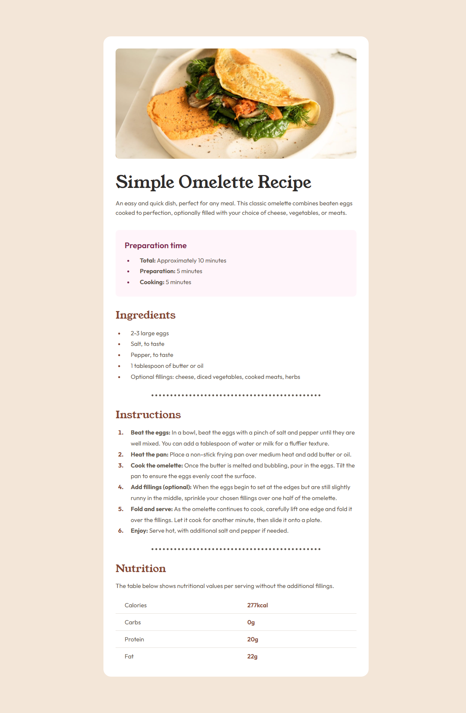

# Frontend Mentor - Recipe page solution

This is a solution to the [Recipe page challenge on Frontend Mentor](https://www.frontendmentor.io/challenges/recipe-page-KiTsR8QQKm).

## Table of contents

- [Overview](#overview)
  - [Screenshot](#screenshot)
  - [Links](#links)
- [My process](#my-process)
  - [Built with](#built-with)
- [Author](#author)

## Overview

### Screenshot

### Links

- Solution URL: [GitHub](https://github.com/Hicham-BC/recipe-page-main)
- Live Site URL: [Recipe page](https://hicham-bc.github.io/recipe-page-main/)

## My process

### Built with

- Semantic HTML5 markup
- CSS custom properties
- CSS Grid

## Author

- Website - [@Hicham-BC](https://github.com/Hicham-BC)
- Frontend Mentor - [@Hicham-BC](https://www.frontendmentor.io/profile/Hicham-BC)